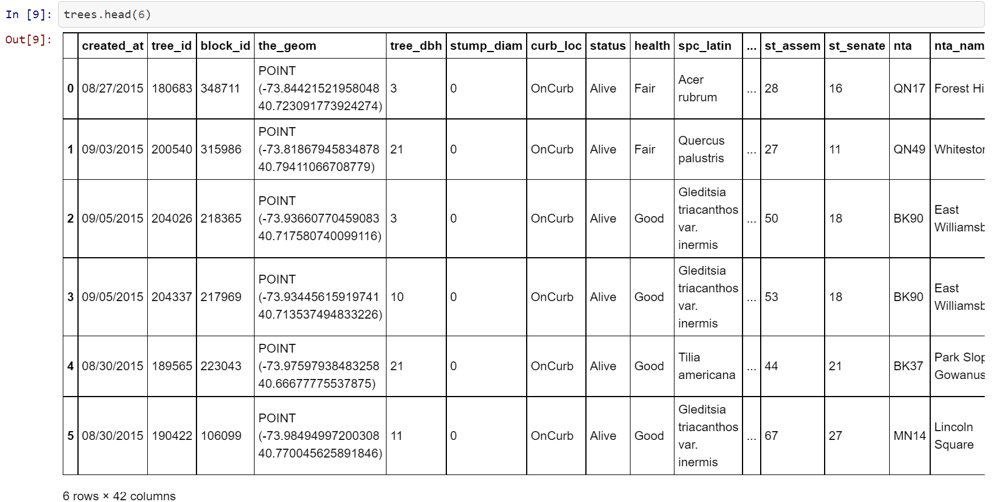
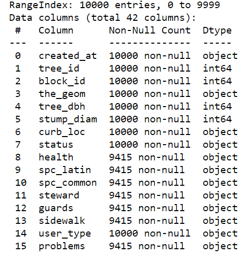

# nyc-trees

# Description :
The task of this assignement is to clean the dataset "2015 Street Tree Census: Tree Data"
(source: https://data.cityofnewyork.us/Environment/2015-Street-Tree-Census-Tree-Data/uvpi-gqnh). By cleaning they mean:
- The dataset contains no missing values ("" or null)
- No duplicates.
- Values are consolidated
- Data format is correct
- No blank spaces

# Installation:
Just run nyc-trees.py

# Usage 
To clean the dataset "2015 Street Tree Census: Tree Data" (input dataset:  data_100000.csv size (42x100000), output: data_trees_100000_clean.csv size ())

#(Visuals)

# Contributors:
Solo project.

# Timeline:
In order to perform a good cleaning, we need to know what the dataset is about and what kind of information is in it. 

I take a quick look to the dataset to now the size and some basic characteristics as columns name, data type, etc...

A description about each column is provided in the document StreetTreeCensus2015TreesDataDictionary20161102.pdf so the first step is to read the document in order
to decide which columns can be dropped and the type of data or content we should find on each column.

Considering this, after the first reading, I decided to drop ([column index in the dataset] column name):
- [1] tree_id 
According to the document "It specifically identifies data entered by a specific user on a specific survey, not the tree itself"
-[3] the_geom
It seems just a combination of latitude and longitude in one column
-[11] steward
"Indicates the number of unique signs of stewardship observed for this tree. Not recorded for stumps or dead trees." This column doesn't seem relevant to me
- [15] problems
This is like the sum of columns 16, 17, 18, putting all the problems a tree might have together. Thus redundant information.
-[30] boroname
"Name of borough in which tree point is located" column 29 has the code for the borough so I keep only 29
-[31] cncldist
-[32] st_assem
-[33] st_senate
These three columns have information the district and other details that can be obtained using for instance columns 29.
-[37] state
The entire columns has the same value 'New York' so it can be deleted, and in the dataset specification I will add that is data only from New York.

